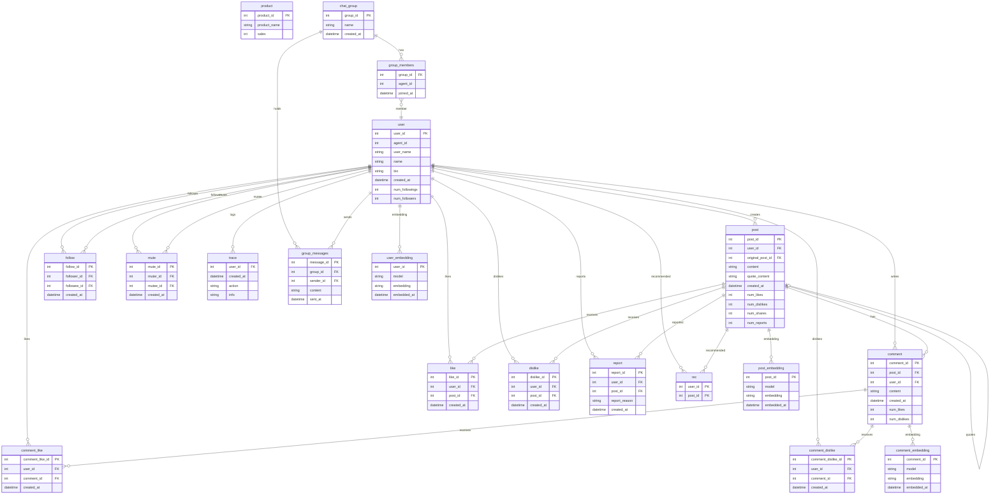

# AI Agent Plurality Simulation

## 研究目的
近年、SNS上でのエコーチェンバー現象による社会的分断の深刻化が指摘されている。この現象は、異質な意見を持つ市民間の議論を減少させる政治的影響に加え、心理的な分断をもたらす懸念がある。

エコーチェンバー現象の主要因の一つとして、パーソナライズ機能が挙げられる。同機能はユーザーの嗜好に合致したコンテンツを優先的に提示することで顧客満足度を高め、滞在時間を延長させる効果を持つ一方で、前述のような負の側面も孕んでいる。

本研究では、ユーザー体験の向上と社会的分断の抑制という二律背反的な課題に対し、適切なバランスを保つ推薦システムやプロダクトデザインのあり方を探究する。具体的には、AIエージェントを用いたシミュレーションを通じて検証を行う。

AIエージェントを用いる理由は以下の二点である。
第一に、人間を対象とした実験におけるコストや倫理的制約を回避するためである。
第二に、将来的に人々がAIエージェントを介して情報を取得することが一般化すると予想される中で、パーソナライズされたAIエージェント自身がエコーチェンバーの影響を受ける可能性を検証することは、今後のエージェント設計や倫理的ガイドラインの策定において重要であると考えるためである。

## 研究内容

### シミュレーション概要
100体の異なるペルソナ（性格、政治的志向、興味関心）が付与されたAI Agentを作成し、閉じたSNS環境内での相互作用をシミュレーションする。

### 実験プロセス
1. **初期化 (Initialization)**: 
   - 100体のエージェントを生成。各エージェントには異なるバックグラウンドと初期意見ベクトルを持たせる。
2. **初期投稿 (Seeding)**: 
   - `data/seeding.json` に定義されたシードデータを使用して、ランダムに選択されたエージェントが初期投稿を行う。これにより議論のトピックを設定する。
3. **インタラクションループ (Interaction Loop)**: 
   - 各ラウンドでは、全エージェントではなく `--agent-action-ratio` で指定された割合（デフォルト30%）のエージェントがランダムに選択されて行動する。
   - **推薦 (Recommendation)**: 実験対象のアルゴリズムに基づき、各エージェントにタイムライン（投稿リスト）を提示。
   - **反応 (Reaction)**: エージェントは提示された投稿に対し、閲覧・Like・コメント・無視などの行動を選択する。
   - **意見変容 (Update)**: 接触した情報に基づき、エージェントの内部状態（意見）を更新する。
   - **新規投稿 (Post)**: 更新された意見に基づき、新たな投稿を行う。
4. **評価 (Evaluation)**: 
   - 一定ラウンド終了後、ログデータを分析し指標を算出する。

### シミュレーション環境
- **Framework**: [Oasis (Camel-AI)](https://github.com/camel-ai/oasis) - AIエージェントベースの社会シミュレーションライブラリ
- **LLM**: OpenAI GPT-4o / GPT-4o-mini (予定)
- **Language**: Python

## 使い方
- Python 3.12+ と依存ライブラリをインストールする。
   ```bash
   pip install -e .
   # または uv を使用する場合
   uv sync
   ```
- OpenAI の API キーを環境変数 `OPENAI_API_KEY` に設定する（`.env` に記載して `mise` / `uv` から読み込むのがおすすめ）。
- （任意）温度を固定したい場合は `OPENAI_MODEL_TEMPERATURE` を設定。`gpt-5-nano` など温度指定不可モデルでは未指定にすること。
- Neo4j を Docker Compose で起動する。
   ```bash
   docker compose up neo4j -d
   ```
   デフォルト認証情報は `neo4j/neo4j1234`（`docker-compose.yml` 参照）。停止する場合は `docker compose down`。
- シミュレーションを実行する。
   ```bash
   uv run main.py --persona-path data/persona/persona.json --seed-post-count 20 --llm-rounds 1
   ```
実行結果は `results/<timestamp>/` 以下に保存され、`simulation.db`、`metadata.yaml`、使用ペルソナのコピー、設定ファイルのスナップショット（`config/` 配下）などが生成される。実行ログは `results/index.csv` と `results/latest_run.txt` に追記される。
   ※ シードファイルが存在しない／空の場合はエラーで停止します。パスの指定に注意してください。

   **エラー時の挙動:**
   - LLMアクションで例外が発生した場合は fail-fast で即座に実行を停止します（サイレントな継続を防止）。

   **主要なオプション:**
   | オプション | デフォルト | 説明 |
   |-----------|-----------|------|
   | `--persona-path` | `data/persona/persona.json` | ペルソナJSONファイルのパス |
   | `--seeding-path` | `data/seeding.json` | 初期投稿用シードデータのJSONファイルパス |
   | `--seed-post-count` | `20` | 初期投稿の数 |
   | `--llm-rounds` | `1` | LLMによるアクションラウンド数 |
   | `--agent-action-ratio` | `0.3` | 各LLMラウンドで行動するエージェントの割合（0.0〜1.0） |
   | `--recommendation-type` | `random` | コンテンツ推薦アルゴリズムの種類（下記参照） |
   | `--model-type` | `gpt-4o` | 利用するモデルID（例: `gpt-4o`, `gpt-4o-mini`, `gpt-5-nano`。未登録の文字列も可） |
   | `--model-temperature` | `unset` | モデルに渡す温度。未指定ならモデルデフォルト（`gpt-5-nano` など温度指定不可モデルで必須） |

   **推薦アルゴリズムの種類:**
   | タイプ | 説明 |
   |--------|------|
   | `random` | ランダム推薦（ベースライン） |
   | `collaborative` | 協調フィルタリング（類似ユーザーの行動に基づく） |
   | `bridging` | 分断修復型（異なる意見クラスター間をつなぐコンテンツを優先） |

   **使用例:**
   ```bash
   # 50%のエージェントが各ラウンドで行動
   uv run main.py --agent-action-ratio 0.5 --llm-rounds 3

   # カスタムシードファイルを使用
   uv run main.py --seeding-path data/custom_seeding.json

   # 分断修復型アルゴリズムでシミュレーション
   uv run main.py --recommendation-type bridging --llm-rounds 5

   # 協調フィルタリングで比較
   uv run main.py --recommendation-type collaborative --llm-rounds 5

   # OpenAI の新モデル（例: gpt-5-nano）を温度未指定で使う
   uv run main.py --model-type gpt-5-nano --model-temperature "" --llm-rounds 3
   ```
- Neo4j に可視化用のノード・エッジを投入する。
   ```bash
   uv run src/visualization/neo4j_export.py --neo4j-password neo4j1234
   ```
   `results/latest_run.txt` のディレクトリから `simulation.db` を読み込み、Neo4j を上書きする。完了後は同ディレクトリに `graph.graphml` と `neo4j_export.yaml` が生成される。Neo4j Browser で `MATCH (n) RETURN n LIMIT 200;` などを実行するとネットワークを確認できる。

### Streamlit ダッシュボード（Neo4j不要・簡易可視化）
Neo4j を経由せず、生成された SQLite (`simulation.db`) を直接読み込んで可視化する簡易ダッシュボード。

```bash
# 推奨: uv 経由で実行
uv run streamlit run src/visualization/streamlit_app.py

# もしくは仮想環境を有効化した状態で
streamlit run src/visualization/streamlit_app.py
```

- デフォルトの DB パスは `results/latest_run.txt` が指す最新実行の `simulation.db`。サイドバーで任意パスに変更可。
- 表示内容: 概要指標（ユーザー・ポスト・コメント・フォロー・いいね）、評価指標（密度/平均クラスタ係数/トランジティビティ/最短経路長/モジュラリティ）、最新ポストとコメント一覧、フォロー関係グラフ、ユーザー×ポストいいね関係グラフ、フォロワー上位ユーザー一覧。
- 以前の `python streamlit_app.py` 形式はコンテキスト警告が出るため、必ず `streamlit run ...` を使用してください。

### Neo4j Browser による可視化（推奨）
Neo4j Browser を使用してシミュレーション結果をグラフとして可視化・分析できる。

1. Neo4j を起動する。
   ```bash
   docker compose up neo4j -d
   ```

2. シミュレーション実行後、Neo4j にデータをエクスポートする。
   ```bash
   uv run src/visualization/neo4j_export.py --neo4j-password neo4j1234
   ```

3. ブラウザで http://localhost:7474 にアクセスする。
   - 認証情報: `neo4j` / `neo4j1234`

4. `data/neo4j_queries.cypher` に定義された分析クエリを実行する。

**主要な分析クエリ:**
| カテゴリ | 内容 |
|----------|------|
| 基本統計 | ユーザー数、投稿数、コメント数、いいね数 |
| ユーザー分析 | 職業別・地域別・年齢別分布 |
| 投稿分析 | いいね数ランキング、コメント数ランキング |
| ネットワーク分析 | ソーシャルネットワーク全体図、ユーザー間インタラクション |
| エコーチェンバー分析 | 同職業/異職業間いいね、孤立ユーザー、相互いいねペア |
| 行動ログ | 行動タイプ分布、ユーザー別行動数 |

**クエリ例（Neo4j Browser で実行）:**
```cypher
// ソーシャルネットワーク全体図
MATCH (u:User)-[r:LIKED|POSTED|WROTE_COMMENT]->(target)
RETURN u, r, target LIMIT 200;

// エコーチェンバー分析: 同職業間 vs 異職業間いいね
MATCH (liker:User)-[:LIKED]->(p:Post)<-[:POSTED]-(poster:User)
WHERE liker.occupation IS NOT NULL AND poster.occupation IS NOT NULL
WITH liker.occupation = poster.occupation AS same_occupation, count(*) AS likes
RETURN 
  CASE same_occupation WHEN true THEN '同職業間' ELSE '異職業間' END AS category,
  likes;
```

### NeoDash ダッシュボード（オプション）
NeoDash を使用することで、カスタムダッシュボードでシミュレーション結果を可視化できる。
> **Note:** Apple Silicon Mac では動作が不安定な場合があります。その場合は Neo4j Browser を使用してください。

1. Neo4j と NeoDash を起動する。
   ```bash
   docker compose up neo4j neodash -d
   ```

2. シミュレーション実行後、Neo4j にデータをエクスポートする。
   ```bash
   uv run src/visualization/neo4j_export.py
   ```

3. 事前定義のダッシュボードをインポートする。
   ```bash
   uv run src/visualization/neodash_import.py
   ```

4. ブラウザで http://localhost:5005 にアクセスする。
   - 接続情報を入力：Protocol `neo4j://`、Host `localhost`、Port `7687`、Username `neo4j`、Password `neo4j1234`
   - 接続後「Load」→「Load from Neo4j」をクリック

- よく使うコマンドは [mise](https://mise.jdx.dev/) のタスクからも実行できる。
   ```bash
   mise run simulation
   mise run neo4j-up
   mise run neo4j-export
   mise run neodash-up
   mise run neodash-import
   mise run dashboard-up  # Neo4j + NeoDash + ダッシュボードインポートを一括実行
   mise run evaluate
   ```
   追加引数は `mise run simulation -- --seed-post-count 50 --llm-rounds 5` のように `--` 以降へ渡すか、`mise run simulation seed_post_count=50` のようにテンプレート変数として指定できる。

### 実験管理とバージョン管理
- 各実行は UTC タイムスタンプをもとに `results/<timestamp>/` へ保存される。
- `metadata.yaml` にはペルソナ、シード設定、LLM ラウンド数、Git コミット ID、エラーの有無などのメタ情報が記録される。
- `config/` には実行時点の主要設定ファイル（`.env`、`.mise.toml`、`docker-compose.yml`、`pyproject.toml`、`uv.lock`）と CLI 引数 `run_args.yaml`、Neo4j 接続情報 `neo4j.yaml` がコピーされる。
- 失敗した実行でもアーティファクトが保存され、`metadata.yaml` および `results/index.csv` の `status` / `error` カラムで確認できる。
- 最新実行パスは `results/latest_run.txt` に記録され、Neo4j エクスポートや評価スクリプトの参照先に利用される。

## データ保管について
- `results/`
   - 各実験ディレクトリ: `simulation.db`、`metadata.yaml`、ペルソナコピー、`config/`（設定スナップショット）、`graph.graphml` や `neo4j_export.yaml`（エクスポート実行時）などを格納。
   - `index.csv`: 実行履歴（タイムスタンプ、パラメータ、ステータス、エラー内容、参照ファイル等）。
   - `latest_run.txt`: 直近の成功実行ディレクトリ（Neo4j エクスポートや評価の既定入力に利用）。
- `log/`: Oasis / CAMEL-OASIS が出力した各種ログファイル。
- `data/neo4j/`: Docker Compose で起動した Neo4j のデータ・ログ・プラグインディレクトリ。自動生成されるため手動編集は不要。

## データベース構成（SQLite）
- 生成物は `results/<timestamp>/simulation.db`（またはデフォルトの `data/twitter_simulation.db`）。OASIS がソーシャルグラフを管理し、独自に作成する各種ログテーブルがあります。
- 埋め込みを計算すると `post_embedding` / `comment_embedding` / `user_embedding` が追加されます（`src/simulation/embedding_store.py`）。  
- `like` / `dislike` / `rec` テーブルの外部キーは `tweet(post_id)` を指す定義になっていますが、実体は `post.post_id` と対応します（SQLite の外部キー制約はデフォルト無効）。



主要テーブル概要:
- `user` / `post` / `comment`: ユーザー・投稿・コメント本体。`post.original_post_id` と `quote_content` で引用/リポストを表現。
- `follow` / `mute`: フォロー・ミュート関係。`num_followings` / `num_followers` はカウンタ。
- `like` / `dislike` / `report` / `rec`: 投稿に対する反応・推薦ログ。`rec` は提示された投稿の記録。
- `comment_like` / `comment_dislike`: コメントへのリアクション。
- `trace`: 行動ログ（`action` と任意 JSON 文字列 `info`）。
- `chat_group` / `group_members` / `group_messages`: グループチャット機能（試験的）。
- `product`: 現状シミュレーション内では未使用のプレースホルダー。
- `*_embedding`: 埋め込みベクトルの永続化。`embedding` は JSON 文字列として格納。

### 検討する推薦アルゴリズム
本研究では、以下のアルゴリズムによる社会動態の違いを比較検証する。`--recommendation-type` オプションで指定可能。

1. **ランダム (random)**: 
   - ベースライン。無作為にコンテンツを提示。
   - 実装: `RandomRecommender`
   
2. **協調フィルタリング (collaborative)**: 
   - 類似した嗜好を持つユーザーの行動履歴に基づく推薦。
   - ユーザーの埋め込みベクトルや意見ベクトルの類似度で近いユーザーを特定し、そのユーザーがいいね/リポストした投稿を推薦。
   - エコーチェンバーを促進する可能性があるため、同期バズ（全員が同じ投稿に収束）を崩す仕掛けを入れている。
   - 実装: `CollaborativeFilteringRecommender`
   - 計算の流れ（実装準拠）:
     1) 近傍ユーザー探索:
        - 類似度はコサイン類似度。
        - `similarity_threshold` 以上を候補とし、上位 `k_neighbors` を採用。
     2) 投稿スコア集計:
        - 近傍ユーザーが反応した投稿に対してスコアを足し上げる。
        - 1投稿あたりの加点は次で重み付け:
          - 類似度: `sim(u, v)`
          - 新しさ（減衰）: `freshness(p)`（最新反応時刻に対する指数減衰）
          - 人気ペナルティ: `1 / (1 + log(1 + freq(p)))`
        - まとめると概ね:
          - `score(u, p) += sim(u, v) * freshness(p) * pop_penalty(p)`
     3) 同期バズ対策（collapse countermeasures）:
        - 温度付きサンプリング:
          - スコア上位をそのまま採用せず、`softmax(score / temperature)` に基づいてサンプリング（確率化）。
        - 多様性再ランキング（MMR）:
          - 候補集合に対し、`lambda * relevance - (1 - lambda) * max_similarity` を最大化する順に並べ替え。
          - 投稿埋め込みがある場合に効き、近い内容の重複提示を抑える。
        - 探索混入（explore_ratio）:
          - 最終リストの一部を未提示候補からランダムに差し込む。
     4) プラットフォーム側の露出cap（全体制御）:
        - `rec` テーブル再構築時に「同一投稿の露出上限」を適用。
        - 上限を超えた投稿はスキップし、不足分は別候補で補充。
        - 実装: `src/simulation/simulation.py` の `_rebuild_rec_table`

3. **分断修復型 (bridging)**: 
   - 異なる意見クラスター間をつなぐ（両者から支持される）コンテンツを優先的に提示。
   - 異なる意見を持つユーザーから支持を得ている投稿を高スコア化。
   - 実装: `BridgingRecommender`

## 評価指標

### 1. 情報接触の偏り (Exposure)
- **Intra-List Similarity (ILS)**: 推薦リスト内のコンテンツ類似度。高いほど情報が均質化していることを示す。
- **Category Entropy**: 接触した情報のカテゴリ分布のエントロピー。

### 2. 意見の極性化 (Polarization)
- **Opinion Drift**: エージェントの意見ベクトルが初期値からどれだけ移動したか。
- **Polarization Index**: 集団全体の意見分布の分散や双峰性（Bimodality）を測定。

### 3. 構造的分断 (Segregation)
- **Modularity**: エージェント間の「いいね」やフォロー関係からグラフを構築し、コミュニティの分断度合いを測る。
- **Echo Chamber Score**: 自分と似た意見のコンテンツに接触した割合 vs 異なる意見に接触した割合。

## 実験ログと再現性メモ（warmup の記録）
- `--warmup-random-rounds N` を指定すると、最初の N ラウンドは random 推薦で探索を入れ、その後は指定アルゴリズムに切り替える。
- この値は以下に保存される:
  - `results/<run>/config/run_args.yaml`
  - `results/index.csv` の `warmup_random_rounds` 列
  - `results/<run>/step_metrics.csv` の `warmup_random_rounds` / `warmup_phase` / `active_recommender` 列

## フォルダ構成
```text
.
├── data/
│   ├── persona/             # エージェントのペルソナ定義
│   ├── seeding.json         # 初期投稿用シードデータ
│   └── neo4j/               # Docker Compose による Neo4j の永続化領域
├── log/                     # OASIS ランタイムのログ
├── results/                 # 実験ごとの成果物とサマリーファイル
├── src/
│   ├── agents/              # ペルソナ読み込み・エージェント生成
│   ├── algorithms/          # コンテンツ推薦・モデレーションアルゴリズム
│   │   └── contents_moderation.py  # 3種類の推薦アルゴリズム実装
│   ├── evaluation/          # グラフ指標計算などの評価ツール
│   ├── simulation/          # シミュレーションのエントリポイント
│   └── visualization/       # Neo4j エクスポート他
├── main.py                  # CLI ラッパー（実験管理・アーティファクト保存）
├── pyproject.toml / uv.lock # 依存関係管理
├── docker-compose.yml       # Neo4j スタック定義
├── .mise.toml               # mise タスク定義
├── README.md
└── ...
```
